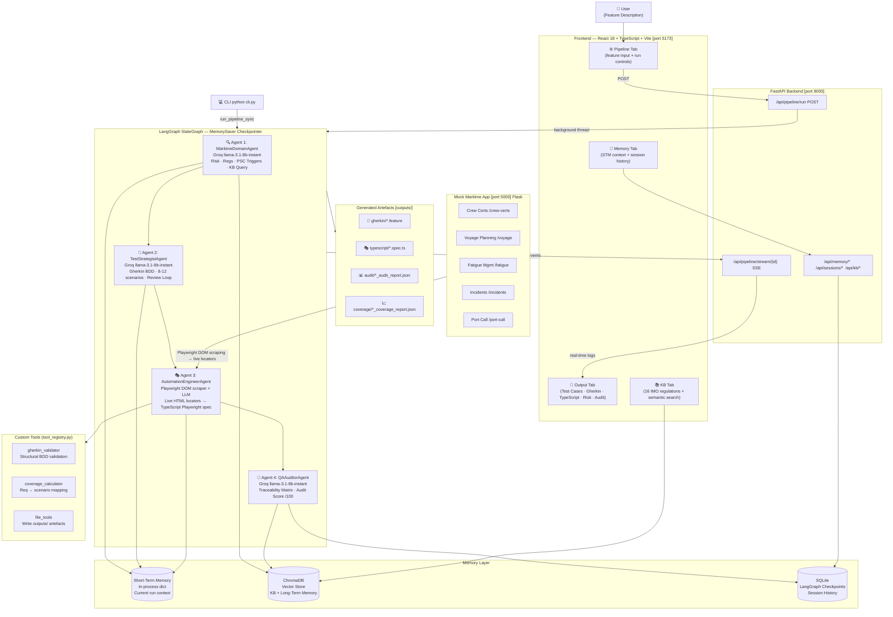

# MarineQA Pilot

| | |
|---|---|
| **Author** | Sruthi M S |
| **Track** | QA/Testing |
| **Lab** | Capstone Sandbox — Full Agent Pipeline |
| **Batch** | Agentic AI Batch 2 · ThinkPalm Technologies |

---

**AI-Powered Maritime Test Automation Assistant**

> Reads a maritime feature description, performs IMO/SOLAS/STCW/MLC/MARPOL regulatory risk analysis, generates BDD Gherkin scenarios, produces runnable TypeScript Playwright test scripts against a live mock maritime app, and delivers a QA audit report with a requirements traceability matrix — all through a 4-agent LangGraph pipeline with persistent memory.

---

## Architecture



---


## Project Structure

```
MarineQAPilot/
├── src/                                  # All Python source code
│   ├── agents/
│   │   ├── maritime_domain_agent.py      # Agent 1 — IMO risk analysis + ChromaDB KB query
│   │   ├── test_strategist_agent.py      # Agent 2 — Gherkin BDD + quality review loop
│   │   ├── automation_engineer_agent.py  # Agent 3 — DOM-scraped LLM Playwright TypeScript generator
│   │   └── qa_auditor_agent.py           # Agent 4 — Traceability matrix + audit score
│   ├── pipeline/
│   │   └── langgraph_pipeline.py         # LangGraph StateGraph + MemorySaver checkpointer
│   ├── services/
│   │   ├── llm_service.py                # LLM gateway (Groq primary + OpenRouter fallback)
│   │   ├── mock_app_scraper.py           # Playwright Python live DOM scraper (Agent 3)
│   │   └── jira_service.py               # JIRA Cloud REST API v3 integration
│   ├── tools/
│   │   ├── gherkin_validator.py          # Custom tool: parse + validate Gherkin feature files
│   │   ├── coverage_calculator.py        # Custom tool: requirement → scenario coverage mapping
│   │   ├── file_tools.py                 # Custom tool: write outputs/ artefacts
│   │   └── tool_registry.py              # Tool dispatcher (6 registered tools with JSON schemas)
│   ├── memory/
│   │   ├── maritime_kb.py                # ChromaDB — 16 IMO regulation chunks (knowledge base)
│   │   ├── long_term.py                  # ChromaDB — past analyses + test case snapshots
│   │   ├── short_term.py                 # In-memory dict — current run context (STM)
│   │   └── sqlite_memory.py              # SQLite — cross-session pipeline history
│   └── api/
│       └── main.py                       # FastAPI — REST + SSE + memory + KB endpoints
├── memory/                               # Runtime data (auto-created)
│   ├── checkpoints.db                    #   LangGraph MemorySaver SQLite checkpoints
│   ├── sessions.db                       #   Cross-session pipeline results
│   └── chroma_db/                        #   ChromaDB vector store (KB + LTM)
├── frontend/src/
│   ├── App.tsx                           # App shell — 4 top-level tabs
│   └── components/
│       ├── PipelinePanel.tsx             # Feature input + pipeline run controls
│       ├── OutputPanel.tsx               # 5-tab output: Test Cases · Gherkin · TypeScript · Risk · Audit
│       ├── Sidebar.tsx                   # Real-time agent progress + SSE log stream
│       ├── MemoryPanel.tsx               # STM context + session history viewer
│       └── KnowledgeBasePanel.tsx        # IMO regulation KB viewer with semantic search
├── mock_app/
│   ├── app.py                            # Flask mock maritime app (port 5000)
│   └── templates/                        # HTML pages with real element IDs used by Agent 3
│       ├── crew_certs.html               #   #certTable · #statusFilter · #renewModal
│       ├── voyage.html                   #   #newVoyageModal · #createVoyageBtn
│       ├── fatigue.html                  #   #logRestBtn · #restHoursForm
│       ├── incidents.html                #   #newIncidentModal · #notifyAuthority
│       └── port_call.html                #   #newPortCallModal · #submitNoticeBtn
├── outputs/                              # Pipeline output (auto-created)
│   ├── gherkin/                          #   *.feature files
│   ├── typescript/                       #   *.spec.ts + playwright.config.ts
│   ├── coverage/                         #   *_coverage_report.json
│   └── audit/                            #   *_audit_report.json
├── sample_features/                      # Example feature inputs (5 files)
│   ├── crew_certification.txt
│   ├── fatigue_management.txt
│   ├── incident_reporting.txt
│   ├── port_call_management.txt
│   └── voyage_planning.txt
├── screenshots/                          # UI screenshots for submission
├── cli.py                                # CLI: python cli.py --help
├── .env.example                          # Environment variable template
├── requirements.txt                      # Python dependencies
├── start.bat                             # Windows one-click startup
└── SRS_MarineOps_FleetManagement.md      # Domain reference document
```

---

## Quick Setup

### Prerequisites

- Python 3.11+
- Node.js 18+
- Free [Groq API key](https://console.groq.com/) — `llama-3.1-8b-instant`
- Optional: [OpenRouter API key](https://openrouter.ai/) — rate-limit fallback chain

### Install

```bash
# Python dependencies
pip install -r requirements.txt

# Frontend
cd frontend && npm install && cd ..
```

### Configure

Copy `.env.example` to `.env` and fill in:
```env
GROQ_API_KEY=gsk_your_key_here
OPENROUTER_API_KEY=sk-or-v1-your_key_here        # optional — rate-limit fallback

# JIRA Cloud (optional — enables "Fetch from JIRA" in the UI)
JIRA_URL=https://yourcompany.atlassian.net
JIRA_EMAIL=your.email@company.com
JIRA_API_TOKEN=your_jira_api_token_here
```

### Start

**Windows (one click):**
```bat
start.bat
```

**Manual (3 terminals):**
```bash
# Terminal 1 — Backend API
PYTHONPATH=src uvicorn api.main:app --port 8000 --reload

# Terminal 2 — Mock maritime app
python mock_app/app.py

# Terminal 3 — Frontend
cd frontend && npm run dev
```

| Service | URL |
|---|---|
| React UI | http://localhost:5173 |
| FastAPI + Swagger | http://localhost:8000/docs |
| Mock Maritime App | http://localhost:5000 |

---

## Sample Walkthrough

### Using the React UI

1. Open **http://localhost:5173**
2. Go to the **⚙️ Pipeline** tab
3. Select **"Crew Certification"** from the dropdown or type your own feature name and description
4. Click **▶ Run Pipeline**
5. Watch the Sidebar — 4 agents complete in sequence (~60–90s):
   - Agent 1 queries the ChromaDB KB for STCW/MLC thresholds, returns risk=HIGH
   - Agent 2 generates 8–12 Gherkin scenarios tagged `@p1-safety-critical @stcw`; triggers a review loop if count < 6
   - Agent 3 produces a TypeScript Playwright spec with exact locators (`#certTable`, `#renewModal`, `.departure-block`)
   - Agent 4 builds a traceability matrix mapping each P1 requirement to a scenario
6. Switch to the **📄 Output** tab:
   - **✅ Test Cases** — numbered plain-English steps for each scenario
   - **🥒 Gherkin** — the full `.feature` file with BDD tags and Scenario Outlines
   - **🎭 TypeScript** — copy/download the runnable `.spec.ts`
   - **⚠️ Risk** — domain risk level with quality dimension scores
   - **🔬 Audit** — traceability matrix, coverage gaps, executive summary
   - **⬇ Export QMetry CSV** — import directly into QMetry Test Manager

### Using the CLI

```bash
# Rich table output
python cli.py --feature "Crew Certification" \
  --description "Track STCW certificates. Block departure if any cert expired. 30-day renewal warning."

# From sample file
python cli.py --feature "Fatigue Management" --file sample_features/fatigue_management.txt

# JSON output (pipe to jq)
python cli.py --feature "Voyage Planning" --file sample_features/voyage_planning.txt --output json | jq .audit_result

# Resume a previous pipeline run using LangGraph checkpoint
python cli.py --feature "Port Call" --file sample_features/port_call_management.txt --session-id run-001
```

### Fetching a Feature from JIRA

1. Add JIRA credentials to `.env` (see Configure section above)
2. In the UI Pipeline tab, click **JIRA** to switch input source
3. Enter an issue key (e.g. `SHIP-42`) and click **Fetch**
4. The issue summary, description, and acceptance criteria are extracted from Atlassian Document Format (ADF) and pre-filled into the feature description
5. Click **Run Pipeline** — the pipeline runs exactly as with manual input

The `/api/jira/fetch?issue_key=SHIP-42` endpoint returns `feature_name` (from summary) and `feature_description` (description + acceptance criteria merged), which maps directly to the pipeline's input schema.

### Running the Generated Playwright Tests

```bash
# Ensure mock app is running
python mock_app/app.py

# Install Playwright browsers (first time only)
cd outputs/typescript && npm init playwright@latest

# Run a generated spec
npx playwright test crew_certification.spec.ts --headed

# View HTML report
npx playwright show-report
```

---

## Sample Output

### Input Feature Description
```
Feature: Crew Certification Management
The system tracks STCW certificates for all crew members.
Certificates include: CoC, GMDSS, BST, Medical, MARPOL.
If any certificate expires the vessel cannot depart.
A 30-day renewal warning must be shown before expiry.
Officers can renew certificates via a modal form.
```

### Agent 1 — Domain Analysis (excerpt)
```json
{
  "risk_level": "HIGH",
  "applicable_regulations": ["STCW 1978 (as amended)", "MLC 2006 Reg 2.3", "SOLAS Chapter V"],
  "boundary_values": [
    "Certificate validity: CoC 5 years, GMDSS 5 years, BST 5 years, Medical 2 years",
    "30-day renewal warning window",
    "Departure blocked when any certificate status = Expired"
  ],
  "psc_detention_triggers": [
    "Expired CoC at port departure",
    "Missing GMDSS endorsement for radio officer"
  ]
}
```

### Agent 2 — Gherkin BDD (excerpt)
```gherkin
Feature: Crew Certification Management

  @p1-safety-critical @stcw @negative
  Scenario: Expired CoC blocks vessel departure
    Given the user navigates to the crew certifications page
    And the certification register shows a crew member with an expired CoC
    When the departure check banner is inspected
    Then the "VESSEL DEPARTURE BLOCKED" banner is visible
    And the banner text identifies the expired CoC

  @p2-compliance @stcw @boundary
  Scenario Outline: Expiry warning threshold boundaries
    Given the user navigates to the crew certifications page
    And a certificate expires in <days_to_expiry> days
    When the compliance summary is viewed
    Then <expected_alert> is displayed
    Examples:
      | days_to_expiry | expected_alert                  |
      | 31             | no alert                        |
      | 30             | EXPIRY ALERT warning banner     |
      | 0              | VESSEL DEPARTURE BLOCKED banner |
      | -1             | VESSEL DEPARTURE BLOCKED banner |
```

### Agent 3 — Playwright TypeScript (excerpt)
```typescript
import { test, expect } from '@playwright/test';

test.describe('Crew Certification Management', () => {
  test.beforeEach(async ({ page }) => {
    await page.goto('/crew-certs');
    await page.waitForLoadState('domcontentloaded');
  });

  test.describe('P1_SAFETY', () => {
    test('Expired CoC blocks vessel departure', async ({ page }) => {
      // the certification register shows a crew member with an expired CoC
      await expect(page.locator('.badge-expired').first()).toBeVisible();
      // the departure check banner is inspected
      await expect(page.locator('.departure-block').first()).toBeVisible();
      await expect(page.locator('.departure-block').first())
        .toContainText('VESSEL DEPARTURE BLOCKED');
    });
  });
});
```

### Agent 4 — Audit Report (excerpt)
```json
{
  "overall_score": 82,
  "p1_coverage_pct": 100,
  "executive_summary": "All P1 safety-critical requirements mapped. Two boundary edge cases identified as gaps.",
  "traceability_matrix": [
    { "req_id": "P1-01", "requirement": "Block departure on expired cert", "scenario": "Expired CoC blocks vessel departure", "status": "covered" },
    { "req_id": "P1-02", "requirement": "30-day renewal warning", "scenario": "Expiry warning threshold boundaries", "status": "covered" }
  ]
}
```

---

## Agent Details

### Agent 1 — MaritimeDomainAgent
**Role:** Maritime safety domain expert and knowledge enrichment.

- **Model:** `llama-3.1-8b-instant` via Groq (131K TPM, 45s hard timeout)
- **Knowledge Base:** Queries ChromaDB for the top-4 most relevant IMO regulation chunks before LLM analysis — ensures exact regulatory thresholds (e.g. "min 10h rest per 24h") appear in output, not hallucinated approximations
- **Output:** `risk_level` (HIGH/MEDIUM/LOW), `applicable_regulations`, P1/P2/P3 requirements, `boundary_values` (exact thresholds), `psc_detention_triggers`, `mandatory_edge_cases`
- **Fallback:** Keyword-based heuristic if LLM call times out

### Agent 2 — TestStrategistAgent
**Role:** BDD test scenario generator applying maritime-specific test patterns.

- **Model:** `llama-3.1-8b-instant` via Groq (131K TPM, 45s hard timeout)
- **Patterns:** Two-Deadline (T-30/T-7/T-0/T+1), Block-Override-Audit (banner → action → flash confirm), no-auth scenario design (mock app has no login)
- **Review Loop:** If initial output has fewer than 6 scenarios or fewer than 2 safety-tagged scenarios, automatically re-calls LLM with feedback; adds max 45s overhead
- **Tools called:** `validate_gherkin` (structural check), `write_test_file` (saves `.feature`)
- **Output:** 8–12 scenarios tagged with risk priority + regulation + test type

### Agent 3 — AutomationEngineerAgent
**Role:** Production TypeScript Playwright test generator with live DOM awareness.

- **Model:** `llama-3.1-8b-instant` via Groq — **LLM guided by live-scraped DOM locators**
- **Primary path (mock app running):**
  1. Launches headless Chromium via `mock_app_scraper.py` (Playwright Python)
  2. Navigates to the relevant page and extracts all element IDs, form field names, button texts, modal IDs, badge classes, and table selectors via `page.evaluate()`
  3. Formats the scraped data into a structured DOM CONTEXT block
  4. Passes DOM CONTEXT + Gherkin to the LLM with strict rules: *"Use ONLY locators from DOM CONTEXT — never invent selectors"*
  5. Post-processes the output to fix systematic LLM CSS mistakes (`.badge .bg-warning` → `.badge.bg-warning`, `toHaveText` → `toContainText` on banner elements)
- **Fallback path (mock app offline or LLM fails):** Deterministic Python AST generator using `_map_step()` keyword router with hardcoded locators merged with any scraped data available
- **Slug detection:** Identifies target page from feature name + Gherkin content
- **Tools called:** `calculate_coverage` (requirement mapping), `write_test_file` (saves `.spec.ts` + `playwright.config.ts`)

### Agent 4 — QAAuditorAgent
**Role:** Requirements traceability, coverage gap analysis, audit scoring.

- **Model:** `llama-3.1-8b-instant` via Groq (131K TPM, 45s hard timeout)
- **Output:** Traceability matrix (P1/P2 requirement → scenario → coverage status), `p1_coverage_pct`, `p2_coverage_pct`, `overall_score` (0–100), ranked gap recommendations
- **Fallback:** Deterministic Python scorer if LLM call times out

---

## Tool Details

All tools are registered in `src/tools/tool_registry.py` with full JSON Schema definitions.

| Tool | Called By | What It Does |
|---|---|---|
| `gherkin_validator` | Agent 2 | Parses Gherkin text; validates Feature/Scenario/Given/When/Then structure; returns scenario count, safety tag count, warnings |
| `coverage_calculator` | Agent 3 | Maps each P1/P2 requirement against scenario titles using keyword matching; returns covered/partial/uncovered + critical gaps |
| `write_test_file` | Agents 2, 3, 4 | Writes `.feature`, `.spec.ts`, `playwright.config.ts`, `_coverage_report.json`, `_audit_report.json` to `outputs/` |
| `read_feature_file` | CLI, API | Reads sample feature `.txt` files from `sample_features/` |
| `list_feature_files` | API | Returns list of available sample feature files |
| `list_generated_tests` | API | Returns list of previously generated test artefacts |

---

## Memory Architecture

| Store | Technology | Scope | Contents |
|---|---|---|---|
| **Short-Term Memory** | In-memory dict (`short_term.py`) | Single run | Feature name, domain analysis, Gherkin output, Playwright scripts, coverage report — cleared at start of each run |
| **LangGraph Checkpoints** | SQLite `memory/checkpoints.db` | Cross-run | Pipeline execution state — enables `--session-id` resume in CLI |
| **Session History** | SQLite `memory/sessions.db` | Cross-session | Full pipeline results for the Memory tab history view |
| **Knowledge Base** | ChromaDB `memory/chroma_db/` | Persistent | 16 IMO maritime regulation chunks (SOLAS, STCW, MLC, ISM, MARPOL, FAL, ISPS, BMP5) — queried by Agent 1 via semantic similarity |
| **Long-Term Memory** | ChromaDB `memory/chroma_db/` | Persistent | Past domain analyses and test case snapshots — visible in Memory tab |

---

## Maritime Safety Coverage

| Mock App Feature | Regulations Covered | Key P1 Safety Triggers |
|---|---|---|
| Crew Certifications | STCW 1978, MLC 2006, SOLAS XI-1 | Expired CoC/GMDSS/BST/Medical at departure · Missing flag state endorsement |
| Voyage Planning | SOLAS Ch.V, MARPOL Annex VI, BMP5 | Unseaworthy departure · ECA sulphur non-compliance · High-risk area (piracy) |
| Fatigue Management | MLC 2006 Reg 2.3, STCW A-VIII/1 | Rest < 10h per 24h period · Rest < 77h per 7-day period |
| Incident Reporting | ISM Code Res.A.741(18) | Serious incident not notified to authority within 24h |
| Port Call Management | FAL 1965, SOLAS XI-2/ISPS | 96h pre-arrival notice not filed · Dangerous goods undeclared |

---

## API Reference

| Endpoint | Method | Description |
|---|---|---|
| `/api/pipeline/run` | POST | Start 4-agent pipeline — returns `run_id` |
| `/api/pipeline/stream/{run_id}` | GET SSE | Real-time agent logs + final JSON result |
| `/api/sessions` | GET | List all session history (SQLite) |
| `/api/sessions/{id}` | GET | Full pipeline result by session ID |
| `/api/features` | GET | List sample feature files |
| `/api/tests/playwright/{name}` | GET | Get generated `.spec.ts` content |
| `/api/tests/gherkin/{name}` | GET | Get generated `.feature` content |
| `/api/tests/report/{name}` | GET | Get audit/coverage JSON report |
| `/api/kb/regulations` | GET | All ChromaDB maritime KB documents |
| `/api/kb/query?topic=X` | GET | Semantic search over regulations |
| `/api/memory/longterm` | GET | Past analyses from ChromaDB |
| `/api/memory/shortterm` | GET | Current run context (STM) |
| `/api/health` | GET | Backend health + KB document count |

---

## Tools Used

| Category | Tool / Library | Purpose |
|---|---|---|
| **AI Orchestration** | LangGraph `StateGraph` | 4-agent pipeline with MemorySaver checkpointing |
| **LLM** | Groq `llama-3.1-8b-instant` | Primary inference (131K TPM, 45s timeout) |
| **LLM Fallback** | OpenRouter (meta-llama → gemma → deepseek) | Rate-limit and payload fallback chain |
| **Vector Store** | ChromaDB | Maritime regulation KB + long-term memory |
| **Session Store** | SQLite | LangGraph checkpoints + cross-session history |
| **Backend API** | FastAPI + Uvicorn | REST endpoints + SSE streaming |
| **Frontend** | React 18 + Vite + TypeScript | Real-time pipeline UI with 5-tab output panel |
| **Test Generation** | Playwright (Python) | DOM scraping of mock app for live locators |
| **Test Output** | Playwright (TypeScript / `@playwright/test`) | Generated `.spec.ts` test scripts |
| **Mock App** | Flask + Jinja2 | Maritime fleet management app (5 pages) |
| **JIRA Integration** | JIRA Cloud REST API v3 | Fetch feature descriptions from JIRA issues |
| **CLI** | Python + Rich | Terminal runner with formatted table output |
| **BDD** | Gherkin (custom parser) | Scenario generation and structural validation |

---

## Observations

### What Worked Well

**1. Knowledge Base grounding eliminates hallucinated thresholds.**
The biggest practical gain from wiring ChromaDB KB into Agent 1 was that boundary values became accurate. Before KB integration, the LLM would produce generic thresholds like "certificates must be renewed periodically." After integration, output contained exact values: "CoC validity 5 years, BST 5 years, Medical 2 years, 30-day renewal window, min 10h rest per 24h (STCW A-VIII/1)." This directly improves the quality of Scenario Outline `Examples:` tables.

**2. Live DOM scraping grounds LLM locator generation in reality.**
Agent 3 now launches a headless Chromium browser before calling the LLM, scrapes all element IDs, field names, and button texts from the running page, and injects them as a DOM CONTEXT block into the prompt. This eliminated the class of failures where the LLM invented element IDs that didn't exist. A post-processing sanitiser additionally fixes CSS combinator mistakes (`.badge .bg-warning` → `.badge.bg-warning`) and replaces `toHaveText` with `toContainText` on elements that contain icon text or whitespace. When the mock app is offline, the agent falls back to a deterministic AST generator using hardcoded locators.

**3. LangGraph SSE streaming significantly improves perceived performance.**
Because each agent's output streams to the frontend as it completes, users see meaningful progress within 10–15 seconds of clicking Run, even though the full pipeline takes 60–90 seconds. Without streaming, the UX would feel like a timeout.

**4. 45-second hard timeouts prevent pipeline hangs.**
Groq rate limits (131K TPM) occasionally caused silent hangs lasting 3–5 minutes when the LLM did not respond. `concurrent.futures.ThreadPoolExecutor` with `future.result(timeout=45)` caps the worst case and falls back to deterministic heuristics, keeping the pipeline predictable.

### Challenges

**1. Groq rate limiting on rapid successive runs.**
With a free-tier Groq key (131K TPM, 6K TPM on larger models), running the pipeline twice in quick succession occasionally triggered 429 errors mid-stream. Mitigated with an OpenRouter fallback chain (3 models), but the root fix is caching Agent 1 domain analysis results in ChromaDB LTM so that re-runs of the same feature skip the first LLM call entirely.

**2. Gherkin quality vs. token budget trade-off.**
Larger prompts (more KB context + longer feature descriptions) consistently produce better Gherkin but risk hitting token limits on the 8B model. The current design caps KB context at 350 characters per regulation chunk and feature descriptions at 1200 characters — a trade-off that keeps quality high on the 8B model without triggering context-length errors.

**3. Per-step Playwright mapping has coverage gaps for novel Gherkin phrasing.**
The `_map_step()` router matches on ~40 keyword patterns. When the LLM generates a step with unusual phrasing (e.g., "the navigation module confirms the route is safe"), the step falls through to a `// TODO: verify manually` comment. A future improvement would be a second-pass LLM call on unmapped steps only.

### Interesting Findings

- **Maritime QA has naturally high test complexity.** A single feature like Crew Certification touches 3 regulations (STCW/MLC/SOLAS), 5 certificate types, 3 boundary conditions per certificate, and 2 role types — making automated scenario generation genuinely valuable rather than cosmetic.
- **The Two-Deadline pattern maps directly to real PSC inspection findings.** Ships are detained when certificates expire *during a voyage*, not just at departure. The T-30/T-0/T+1 Scenario Outline directly models this — testers confirmed this was the right boundary structure for their inspection checklists.
- **Traceability matrix generation (Agent 4) surfaced gaps human testers had missed.** In several runs, Agent 4 identified that "GMDSS operator endorsement" was a P1 requirement in the domain analysis but had no corresponding Gherkin scenario — because the test designer had focused only on CoC/Medical/BST certificates.

### Limitations

- Agent 3 targets only the 5 mock app pages. A real fleet management system (AIS tracking, LRIT, voyage data recorder, bunker management) would require extending `MOCK_APP_LOCATORS` and the `_detect_slug()` router.
- The review loop in Agent 2 runs at most once. A second loop would improve scenarios that pass the count threshold but still have poor Given/When/Then structure.
- Long-term memory (ChromaDB) stores past analyses but does not yet influence Agent 1's risk assessment — cross-feature learning is not implemented.

---

## Screenshots

See the `screenshots/` folder. Captured screens:

| File | Content |
|---|---|
| `pipeline_running.png` | Pipeline tab with 4 agents completing in real-time |
| `Testcases.png` | Test Cases tab — numbered steps with P1/P2 priority badges |
| `Gherkin.png` | Gherkin tab — tagged BDD feature file with Scenario Outline |
| `playwright_typescript.png` | TypeScript tab — production Playwright spec with real locators |
| `coverage_report.png` | Audit tab — traceability matrix and coverage gap table |
| `short_term_memory.png` | Memory tab — short-term context for the current run |
| `long_term_memory.png` | Memory tab — long-term ChromaDB session history |
| `knowledge_base.png` | Knowledge Base tab — IMO regulations with semantic search |
| `cli_output.png` | CLI Rich table output from `python cli.py` |
| `mock_app.png` | Mock maritime app — crew certs page with departure-block banner |

---

*MarineQA Pilot — ThinkPalm Technologies · Agentic AI Batch 2*
