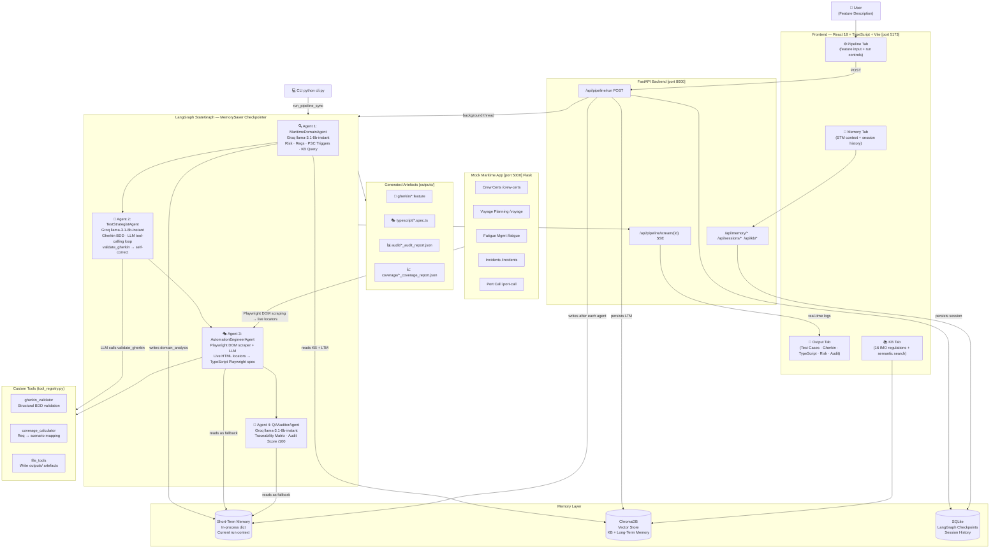

# MarineQA Pilot

| | |
|---|---|
| **Author** | Sruthi M S |
| **Track** | QA/Testing |
| **Lab** | Capstone Sandbox — Full Agent Pipeline |
| **Batch** | Agentic AI Batch 2 · ThinkPalm Technologies |

---

**AI-Powered Maritime Test Automation Assistant**

> Reads a maritime feature description, performs IMO/SOLAS/STCW/MLC/MARPOL regulatory risk analysis, generates BDD Gherkin scenarios, produces runnable TypeScript Playwright test scripts against a live mock maritime app, and delivers a QA audit report with a requirements traceability matrix — all through a 4-agent LangGraph pipeline with persistent memory.

---

## Architecture



---


## Project Structure

```
MarineQAPilot/
├── src/                                  # All Python source code
│   ├── agents/
│   │   ├── maritime_domain_agent.py      # Agent 1 — IMO risk analysis + ChromaDB KB query
│   │   ├── test_strategist_agent.py      # Agent 2 — Gherkin BDD + quality review loop
│   │   ├── automation_engineer_agent.py  # Agent 3 — DOM-scraped LLM Playwright TypeScript generator
│   │   └── qa_auditor_agent.py           # Agent 4 — Traceability matrix + audit score
│   ├── pipeline/
│   │   └── langgraph_pipeline.py         # LangGraph StateGraph + MemorySaver checkpointer
│   ├── services/
│   │   ├── llm_service.py                # LLM gateway (Groq primary + OpenRouter fallback)
│   │   ├── mock_app_scraper.py           # Playwright Python live DOM scraper (Agent 3)
│   │   └── jira_service.py               # JIRA Cloud REST API v3 integration
│   ├── tools/
│   │   ├── gherkin_validator.py          # Custom tool: parse + validate Gherkin feature files
│   │   ├── coverage_calculator.py        # Custom tool: requirement → scenario coverage mapping
│   │   ├── file_tools.py                 # Custom tool: write outputs/ artefacts
│   │   └── tool_registry.py              # Tool dispatcher (6 registered tools with JSON schemas)
│   ├── memory/
│   │   ├── maritime_kb.py                # ChromaDB — 16 IMO regulation chunks (knowledge base)
│   │   ├── long_term.py                  # ChromaDB — past analyses + test case snapshots
│   │   ├── short_term.py                 # In-memory dict — current run context (STM)
│   │   └── sqlite_memory.py              # SQLite — cross-session pipeline history
│   └── api/
│       └── main.py                       # FastAPI — REST + SSE + memory + KB endpoints
├── memory/                               # Runtime data (auto-created)
│   ├── checkpoints.db                    #   LangGraph MemorySaver SQLite checkpoints
│   ├── sessions.db                       #   Cross-session pipeline results
│   └── chroma_db/                        #   ChromaDB vector store (KB + LTM)
├── frontend/src/
│   ├── App.tsx                           # App shell — 4 top-level tabs
│   └── components/
│       ├── PipelinePanel.tsx             # Feature input + pipeline run controls
│       ├── OutputPanel.tsx               # 5-tab output: Test Cases · Gherkin · TypeScript · Risk · Audit
│       ├── Sidebar.tsx                   # Real-time agent progress + SSE log stream
│       ├── MemoryPanel.tsx               # STM context + session history viewer
│       └── KnowledgeBasePanel.tsx        # IMO regulation KB viewer with semantic search
├── mock_app/
│   ├── app.py                            # Flask mock maritime app (port 5000)
│   └── templates/                        # HTML pages with real element IDs used by Agent 3
│       ├── crew_certs.html               #   #certTable · #statusFilter · #renewModal
│       ├── voyage.html                   #   #newVoyageModal · #createVoyageBtn
│       ├── fatigue.html                  #   #logRestBtn · #restHoursForm
│       ├── incidents.html                #   #newIncidentModal · #notifyAuthority
│       └── port_call.html                #   #newPortCallModal · #submitNoticeBtn
├── outputs/                              # Pipeline output (auto-created)
│   ├── gherkin/                          #   *.feature files
│   ├── typescript/                       #   *.spec.ts + playwright.config.ts
│   ├── coverage/                         #   *_coverage_report.json
│   └── audit/                            #   *_audit_report.json
├── sample_features/                      # Example feature inputs (5 files)
│   ├── crew_certification.txt
│   ├── fatigue_management.txt
│   ├── incident_reporting.txt
│   ├── port_call_management.txt
│   └── voyage_planning.txt
├── screenshots/                          # UI screenshots for submission
├── cli.py                                # CLI: python cli.py --help
├── .env.example                          # Environment variable template
├── requirements.txt                      # Python dependencies
├── start.bat                             # Windows one-click startup
└── SRS_MarineOps_FleetManagement.md      # Domain reference document
```

---

## Quick Setup

### Prerequisites

- Python 3.11+
- Node.js 18+
- Free [Groq API key](https://console.groq.com/) — `llama-3.1-8b-instant`
- Optional: [OpenRouter API key](https://openrouter.ai/) — rate-limit fallback chain

### Install

```bash
# Python dependencies
pip install -r requirements.txt

# Frontend
cd frontend && npm install && cd ..
```

### Configure

Copy `.env.example` to `.env` and fill in:
```env
GROQ_API_KEY=gsk_your_key_here
OPENROUTER_API_KEY=sk-or-v1-your_key_here        # optional — rate-limit fallback

# JIRA Cloud (optional — enables "Fetch from JIRA" in the UI)
JIRA_URL=https://yourcompany.atlassian.net
JIRA_EMAIL=your.email@company.com
JIRA_API_TOKEN=your_jira_api_token_here
```

### Start

**Windows (one click):**
```bat
start.bat
```

**Manual (3 terminals):**
```bash
# Terminal 1 — Backend API
PYTHONPATH=src uvicorn api.main:app --port 8000 --reload

# Terminal 2 — Mock maritime app
python mock_app/app.py

# Terminal 3 — Frontend
cd frontend && npm run dev
```

| Service | URL |
|---|---|
| React UI | http://localhost:5173 |
| FastAPI + Swagger | http://localhost:8000/docs |
| Mock Maritime App | http://localhost:5000 |

---

## Sample Walkthrough

### Using the React UI

1. Open **http://localhost:5173**
2. Go to the **⚙️ Pipeline** tab
3. Select **"Crew Certification"** from the dropdown or type your own feature name and description
4. Click **▶ Run Pipeline**
5. Watch the Sidebar — 4 agents complete in sequence (~60–90s):
   - Agent 1 queries the ChromaDB KB for STCW/MLC thresholds, returns risk=HIGH
   - Agent 2 generates 8–12 Gherkin scenarios tagged `@p1-safety-critical @stcw`; triggers a review loop if count < 6
   - Agent 3 produces a TypeScript Playwright spec with exact locators (`#certTable`, `#renewModal`, `.departure-block`)
   - Agent 4 builds a traceability matrix mapping each P1 requirement to a scenario
6. Switch to the **📄 Output** tab:
   - **✅ Test Cases** — numbered plain-English steps for each scenario
   - **🥒 Gherkin** — the full `.feature` file with BDD tags and Scenario Outlines
   - **🎭 TypeScript** — copy/download the runnable `.spec.ts`; click **▶ Run Tests** to execute directly against the mock app (see below)
   - **⚠️ Risk** — domain risk level with quality dimension scores
   - **🔬 Audit** — traceability matrix, coverage gaps, executive summary
   - **⬇ Export QMetry CSV** — import directly into QMetry Test Manager

### Using the CLI

```bash
# Rich table output
python cli.py --feature "Crew Certification" \
  --description "Track STCW certificates. Block departure if any cert expired. 30-day renewal warning."

# From sample file
python cli.py --feature "Fatigue Management" --file sample_features/fatigue_management.txt

# JSON output (pipe to jq)
python cli.py --feature "Voyage Planning" --file sample_features/voyage_planning.txt --output json | jq .audit_result

# Resume a previous pipeline run using LangGraph checkpoint
python cli.py --feature "Port Call" --file sample_features/port_call_management.txt --session-id run-001
```

### Fetching a Feature from JIRA

1. Add JIRA credentials to `.env` (see Configure section above)
2. In the UI Pipeline tab, click **JIRA** to switch input source
3. Enter an issue key (e.g. `SHIP-42`) and click **Fetch**
4. The issue summary, description, and acceptance criteria are extracted from Atlassian Document Format (ADF) and pre-filled into the feature description
5. Click **Run Pipeline** — the pipeline runs exactly as with manual input

The `/api/jira/fetch?issue_key=SHIP-42` endpoint returns `feature_name` (from summary) and `feature_description` (description + acceptance criteria merged), which maps directly to the pipeline's input schema.

### Running the Generated Playwright Tests

#### Option A — From the UI (recommended)

1. Complete a pipeline run for any feature
2. Go to **Output → 🎭 TypeScript** tab
3. Ensure the mock maritime app is running on port 5000
4. Click the **▶ Run Tests** button
5. Results appear inline — each test shows ✅ pass / ❌ fail, duration, and error message on failure

The UI calls `POST /api/tests/run/{feature_name}` which executes `npx playwright test` with a JSON reporter, parses the output, and returns structured results. No terminal access required.

> **First time only:** Install Chromium before using Run Tests:
> ```bash
> cd outputs/typescript && npx playwright install chromium
> ```

#### Option B — From the terminal

```bash
# Ensure mock app is running
python mock_app/app.py

# Install dependencies (first time only — package.json already present)
cd outputs/typescript && npm install
npx playwright install chromium

# Run a generated spec (headed — opens browser window)
npx playwright test voyage_planning.spec.ts --headed

# Run all generated specs with 2 parallel workers
npx playwright test --workers=2

# View HTML report
npx playwright show-report
```

---

## Sample Output — End-to-End Flow

This section traces a **single feature** through all 4 agents, showing how each agent's output feeds the next.

---

### RAW INPUT — Feature Description

```
Feature: Crew Certification Management

The system tracks STCW certificates for all crew members.
Certificates include: CoC, GMDSS, BST, Medical, PSCRB.
If any certificate expires the vessel cannot depart.
A 30-day renewal warning must be shown before expiry.
Officers can renew certificates via a modal form.
The filter dropdown allows viewing by status: All, Expired, Expiring Soon, Valid.
```

---

### AGENT 1 → MaritimeDomainAgent
**What it does:** Queries ChromaDB KB for relevant IMO regulations, enriches the feature with exact safety thresholds, PSC detention triggers, and boundary values. Writes result to short-term memory.

```json
{
  "risk_level": "HIGH",
  "applicable_regulations": [
    "STCW 1978 (as amended)",
    "STCW Regulation I/2 — CoC validity 5 years",
    "MLC 2006 Standard A1.2 — Medical cert 2 years",
    "SOLAS Chapter XI-1"
  ],
  "p1_safety_requirements": [
    "Vessel departure must be blocked when any crew cert is expired",
    "GMDSS operator cert must be valid before navigational watch is assigned"
  ],
  "p2_compliance_requirements": [
    "30-day expiry warning must appear for all cert types",
    "Renewal records must satisfy STCW audit requirements"
  ],
  "boundary_values": [
    "CoC / GMDSS / BST / PSCRB validity: 5 years",
    "Medical cert validity: 2 years (1 year if seafarer under 18)",
    "Expiring Soon threshold: T-30 days",
    "Expired threshold: T-0 (departure blocked)"
  ],
  "psc_detention_triggers": [
    "Expired CoC at port departure — Code 2 deficiency",
    "Missing or expired GMDSS cert — vessel cannot maintain distress watch"
  ],
  "mandatory_edge_cases": [
    "Cert expires exactly on T-30: must show Expiring Soon badge",
    "Cert expires exactly on T-0: must show Expired badge + departure block",
    "Renewing expired cert must clear the departure block banner"
  ]
}
```

> **Memory:** `domain_analysis` written to `session_memory` singleton for Agents 3 & 4.

---

### AGENT 2 → TestStrategistAgent
**What it does:** Uses Agent 1's boundary values, PSC triggers, and edge cases to generate Gherkin BDD scenarios. The LLM calls `validate_gherkin` as a tool, inspects quality (scenario count, safety tags), and self-corrects before returning.

```gherkin
Feature: Crew Certification Management

  @p1-safety-critical @stcw @negative
  Scenario: Expired CoC blocks vessel departure
    Given the user navigates to "/crew-certs"
    And the certification register shows a crew member with an "Expired" CoC badge
    When the departure check banner is inspected
    Then the "VESSEL DEPARTURE BLOCKED" banner is visible
    And the banner identifies the expired CoC as the blocking reason

  @p1-safety-critical @stcw @edge-case
  Scenario: Renewing an expired certificate clears the departure block
    Given the user navigates to "/crew-certs"
    And the "VESSEL DEPARTURE BLOCKED" banner is visible
    When the user clicks the Renew button for the expired CoC
    And fills in a future expiry date and certificate number in the modal
    And clicks Submit
    Then the success flash message is displayed
    And the departure-block banner is no longer visible

  @p2-compliance @stcw @boundary
  Scenario Outline: Expiry warning at T-30 / T-0 / T+1 thresholds
    Given the user navigates to "/crew-certs"
    And a certificate expires in <days_to_expiry> days
    When the compliance summary is viewed
    Then <expected_alert> is displayed
    Examples:
      | days_to_expiry | expected_alert                  |
      | 31             | no alert                        |
      | 30             | EXPIRY ALERT warning banner     |
      | 0              | VESSEL DEPARTURE BLOCKED banner |
      | -1             | VESSEL DEPARTURE BLOCKED banner |

  @p2-compliance @stcw @happy-path
  Scenario: Status filter shows only expired certificates
    Given the user navigates to "/crew-certs"
    When the user selects "Expired" from the status filter dropdown
    Then only rows with the "Expired" badge are displayed in the table
```

> **Tool called by LLM:** `validate_gherkin` → returned `scenario_count=11, safety_tagged=7` → passed quality threshold, no revision needed.
> **File written:** `outputs/gherkin/crew_certification.feature`

---

### AGENT 3 → AutomationEngineerAgent
**What it does:** Scrapes the live mock app DOM at `/crew-certs` (extracts real element IDs, field names, button texts), passes the DOM context + Gherkin to the LLM, which generates TypeScript Playwright tests using **only** confirmed real locators.

*DOM scraped: `#certTable`, `#statusFilter`, `#renewModal`, `input[name='new_expiry']`, `input[name='cert_number']`, `#renewSubmitBtn`, `.departure-block`, `.badge-expired`, `.badge-expiring`, `.badge-valid`, `.alert.alert-success`*

```typescript
import { test, expect } from '@playwright/test';

test.describe('Crew Certification Management', () => {
  test.beforeEach(async ({ page }) => {
    await page.goto('/crew-certs');
    await page.waitForLoadState('domcontentloaded');
  });

  test.describe('P1_SAFETY', () => {
    test('Expired CoC blocks vessel departure', async ({ page }) => {
      await expect(page.locator('.badge-expired').first()).toBeVisible();
      await expect(page.locator('.departure-block').first()).toBeVisible();
      await expect(page.locator('.departure-block').first())
        .toContainText('VESSEL DEPARTURE BLOCKED');
    });

    test('Renewing an expired certificate clears the departure block', async ({ page }) => {
      await page.locator('button.btn-outline-primary').first().click();
      await expect(page.locator('#renewModal')).toBeVisible();
      await page.locator("input[name='new_expiry']").fill('2029-12-31');
      await page.locator("input[name='cert_number']").fill('STCW-2029-00123');
      await page.locator('#renewSubmitBtn').click();
      await page.waitForLoadState('networkidle');
      await expect(page.locator('.alert.alert-success').first()).toBeVisible();
      await expect(page.locator('.departure-block')).toHaveCount(0);
    });
  });

  test.describe('P2_COMPLIANCE', () => {
    test('Status filter shows only expired certificates', async ({ page }) => {
      await page.locator('select#statusFilter').selectOption('expired');
      await expect(page.locator('tr[data-status="expired"]').first()).toBeVisible();
    });
  });
});
```

> **Files written:** `outputs/typescript/crew_certification.spec.ts`, `outputs/typescript/playwright.config.ts`
> **Coverage calculated:** 75% — 2 of 4 requirements mapped to scenarios.

---

### AGENT 4 → QAAuditorAgent
**What it does:** Maps every P1/P2/P3 requirement from Agent 1 against every scenario title from Agent 2. Scores coverage, identifies gaps, and produces a traceability matrix with recommendations.

```json
{
  "overall_score": 88,
  "p1_coverage_pct": 100,
  "p2_coverage_pct": 67,
  "executive_summary": "Crew Certification Management: P1 Safety 100%, P2 Compliance 67%, Score 88/100. One P2 gap identified — Medical cert 2-year boundary not tested.",
  "traceability_matrix": [
    { "req_id": "R1", "requirement": "Block departure on expired cert",        "scenario": "Expired CoC blocks vessel departure",           "status": "covered",  "regulation": "STCW" },
    { "req_id": "R2", "requirement": "GMDSS cert must be valid for watch",     "scenario": "Expired CoC blocks vessel departure",           "status": "partial",  "regulation": "STCW" },
    { "req_id": "C1", "requirement": "30-day expiry warning for all cert types","scenario": "Expiry warning at T-30 / T-0 / T+1 thresholds","status": "covered",  "regulation": "STCW" },
    { "req_id": "C2", "requirement": "Medical cert: 2-year validity boundary", "scenario": null,                                            "status": "gap",      "regulation": "MLC"  }
  ],
  "coverage_gaps": [
    {
      "gap": "Medical cert 2-year validity boundary not covered",
      "priority": "P2",
      "regulation": "MLC 2006 Standard A1.2",
      "recommendation": "Add Scenario Outline: Medical cert at T-730 (2yr), T-729 (Expiring Soon), T-0 (Expired + block)"
    }
  ],
  "recommendations": [
    "P2 compliance coverage is 67% — add Medical cert boundary scenarios before PSC inspection",
    "Schedule automated Playwright test execution against staging before each port call"
  ]
}
```

> **File written:** `outputs/audit/crew_certification_audit_report.json`

---

### FLOW SUMMARY

```
Raw feature description (6 lines)
        │
        ▼
Agent 1 — KB query → HIGH risk, 4 regulations, exact thresholds (CoC 5yr, Medical 2yr, T-30 warning)
        │  writes domain_analysis → session_memory
        ▼
Agent 2 — LLM calls validate_gherkin tool → 11 scenarios, 7 @p1-safety-critical tagged
        │  Two-Deadline Outline: T-31 (no alert) / T-30 (warning) / T-0 (blocked) / T+1 (blocked)
        ▼
Agent 3 — DOM scrape: 11 ids, 6 fields, 4 buttons confirmed → TypeScript spec with real locators
        │  calculate_coverage: 75% of requirements mapped
        ▼
Agent 4 — Traceability matrix: 4 requirements → R1 covered, R2 partial, C1 covered, C2 GAP
          Score: 88/100 | P1: 100% | P2: 67% | 1 gap → Medical cert 2yr boundary missing
```

---

## Agent Details

### Agent 1 — MaritimeDomainAgent
**Role:** Maritime safety domain expert and knowledge enrichment.

- **Model:** `llama-3.1-8b-instant` via Groq (131K TPM, 45s hard timeout)
- **Knowledge Base:** Queries ChromaDB for the top-4 most relevant IMO regulation chunks before LLM analysis — ensures exact regulatory thresholds (e.g. "min 10h rest per 24h") appear in output, not hallucinated approximations
- **Long-Term Memory Read:** Before calling the LLM, searches ChromaDB long-term memory for prior analyses of similar features (similarity ≥ 0.5). If found, injects prior risk levels and P1 requirements as supporting context — enabling cross-feature learning across pipeline runs
- **Short-Term Memory Write:** Writes completed `domain_analysis` to the shared `session_memory` singleton so Agents 3 and 4 can read it as a fallback if LangGraph state is sparse
- **Output:** `risk_level` (HIGH/MEDIUM/LOW), `applicable_regulations`, P1/P2/P3 requirements, `boundary_values` (exact thresholds), `psc_detention_triggers`, `mandatory_edge_cases`
- **Fallback:** Keyword-based heuristic if LLM call times out

### Agent 2 — TestStrategistAgent
**Role:** BDD test scenario generator applying maritime-specific test patterns with LLM-driven tool calling.

- **Model:** `llama-3.1-8b-instant` via Groq (131K TPM, 90s timeout for tool-calling loop)
- **Tool-Calling Loop:** Uses `llm.complete_with_tools()` — the LLM is given the `validate_gherkin` tool schema and decides when to invoke it. After generating Gherkin, the LLM calls `validate_gherkin`, receives structural quality metrics (scenario count, safety tag count), and self-corrects if thresholds are not met — all within a single agentic loop (up to 3 rounds)
- **Patterns:** Two-Deadline (T-30/T-7/T-0/T+1), Block-Override-Audit (banner → action → flash confirm), no-auth scenario design (mock app has no login)
- **Safety Net:** If tool-calling fails (e.g. 413 payload too large), falls back to plain `complete_gen()` then to template generation — pipeline never halts
- **Tools called (LLM-driven):** `validate_gherkin` — LLM decides to call this; result fed back into LLM context for self-correction
- **Tools called (programmatic):** `write_test_file` (saves `.feature` to `outputs/gherkin/`)
- **Output:** 8–12 scenarios tagged with risk priority + regulation + test type

### Agent 3 — AutomationEngineerAgent
**Role:** Production TypeScript Playwright test generator with live DOM awareness.

- **Model:** `llama-3.1-8b-instant` via Groq — **LLM guided by live-scraped DOM locators**
- **Short-Term Memory Read:** Reads `domain_analysis` and `gherkin_output` from `session_memory` as a fallback enrichment if LangGraph state is sparse (e.g. partial pipeline resume)
- **Primary path (mock app running):**
  1. Launches headless Chromium via `mock_app_scraper.py` (Playwright Python)
  2. Navigates to the relevant page and extracts all element IDs, form field names, button texts, modal IDs, badge classes, and table selectors via `page.evaluate()`
  3. Formats the scraped data into a structured DOM CONTEXT block
  4. Passes DOM CONTEXT + Gherkin to the LLM with strict rules: *"Use ONLY locators from DOM CONTEXT — never invent selectors"*
  5. Post-processes the output to fix systematic LLM CSS mistakes (`.badge .bg-warning` → `.badge.bg-warning`, `toHaveText` → `toContainText` on banner elements)
- **Fallback path (mock app offline or LLM fails):** Deterministic Python AST generator using `_map_step()` keyword router with hardcoded locators merged with any scraped data available
- **Slug detection:** Identifies target page from feature name + Gherkin content
- **Tools called:** `calculate_coverage` (requirement mapping), `write_test_file` (saves `.spec.ts` + `playwright.config.ts` to `outputs/typescript/`)

### Agent 4 — QAAuditorAgent
**Role:** Requirements traceability, coverage gap analysis, audit scoring.

- **Model:** `llama-3.1-8b-instant` via Groq (131K TPM, 45s hard timeout)
- **Short-Term Memory Read:** Reads `domain_analysis`, `gherkin_output`, and `playwright_scripts` from `session_memory` as a fallback if LangGraph state is sparse
- **Output:** Traceability matrix (P1/P2 requirement → scenario → coverage status), `p1_coverage_pct`, `p2_coverage_pct`, `overall_score` (0–100), ranked gap recommendations
- **Fallback:** Deterministic Python scorer if LLM call times out

---

## Tool Details

All tools are registered in `src/tools/tool_registry.py` with full JSON Schema definitions compatible with the Groq/OpenAI function-calling API. Agent 2 invokes `validate_gherkin` via the LLM tool-calling loop (`complete_with_tools()`); all other tool calls are programmatic.

| Tool | Invocation | Called By | What It Does |
|---|---|---|---|
| `validate_gherkin` | **LLM-driven** (Agent 2 tool-calling loop) | Agent 2 | Parses Gherkin text; validates Feature/Scenario/Given/When/Then structure; returns scenario count, safety tag count, warnings — LLM reads result and self-corrects |
| `coverage_calculator` | Programmatic | Agent 3 | Maps each P1/P2 requirement against scenario titles using keyword matching; returns covered/partial/uncovered + critical gaps |
| `write_test_file` | Programmatic | Agents 2, 3, 4 | Writes `.feature`, `.spec.ts`, `playwright.config.ts`, `_coverage_report.json`, `_audit_report.json` to `outputs/` |
| `read_feature_file` | Programmatic | CLI, API | Reads sample feature `.txt` files from `sample_features/` |
| `list_feature_files` | Programmatic | API | Returns list of available sample feature files |
| `list_generated_tests` | Programmatic | API | Returns list of previously generated test artefacts |

---

## Memory Architecture

| Store | Technology | Scope | Read by | Write by | Contents |
|---|---|---|---|---|---|
| **Short-Term Memory** | In-memory singleton (`session_memory` in `short_term.py`) | Single run | Agents 3, 4 (fallback enrichment) | API layer + Agent 1 | Feature name, domain analysis, Gherkin output, Playwright scripts, coverage report — cleared at start of each run |
| **LangGraph Checkpoints** | SQLite `memory/checkpoints.db` | Cross-run | LangGraph pipeline | LangGraph pipeline | Pipeline execution state — enables `--session-id` resume in CLI |
| **Session History** | SQLite `memory/sessions.db` | Cross-session | Memory tab, `/api/sessions` | API layer (end of run) | Full pipeline results for the Memory tab history view |
| **Knowledge Base** | ChromaDB `memory/chroma_db/` | Persistent | Agent 1 (top-4 semantic results per run) | Seed on startup | 16 IMO maritime regulation chunks (SOLAS, STCW, MLC, ISM, MARPOL, FAL, ISPS, BMP5) |
| **Long-Term Memory** | ChromaDB `memory/chroma_db/` | Persistent | Agent 1 (prior similar analyses, similarity ≥ 0.5) | API layer (end of run) | Past domain analyses, Gherkin snapshots, coverage reports — cross-feature learning |

> **How memory flows through the pipeline:** Agent 1 reads KB + LTM → enriches its prompt → writes result to STM. Agents 3 and 4 read STM as a fallback. The API layer writes LTM and session history after each completed run.

---

## Maritime Safety Coverage

| Mock App Feature | Regulations Covered | Key P1 Safety Triggers |
|---|---|---|
| Crew Certifications | STCW 1978, MLC 2006, SOLAS XI-1 | Expired CoC/GMDSS/BST/Medical at departure · Missing flag state endorsement |
| Voyage Planning | SOLAS Ch.V, MARPOL Annex VI, BMP5 | Unseaworthy departure · ECA sulphur non-compliance · High-risk area (piracy) |
| Fatigue Management | MLC 2006 Reg 2.3, STCW A-VIII/1 | Rest < 10h per 24h period · Rest < 77h per 7-day period |
| Incident Reporting | ISM Code Res.A.741(18) | Serious incident not notified to authority within 24h |
| Port Call Management | FAL 1965, SOLAS XI-2/ISPS | 96h pre-arrival notice not filed · Dangerous goods undeclared |

---

## API Reference

| Endpoint | Method | Description |
|---|---|---|
| `/api/pipeline/run` | POST | Start 4-agent pipeline — returns `run_id` |
| `/api/pipeline/stream/{run_id}` | GET SSE | Real-time agent logs + final JSON result |
| `/api/sessions` | GET | List all session history (SQLite) |
| `/api/sessions/{id}` | GET | Full pipeline result by session ID |
| `/api/features` | GET | List sample feature files |
| `/api/tests/playwright/{name}` | GET | Get generated `.spec.ts` content |
| `/api/tests/gherkin/{name}` | GET | Get generated `.feature` content |
| `/api/tests/report/{name}` | GET | Get audit/coverage JSON report |
| `/api/tests/run/{feature_name}` | POST | Execute Playwright spec against mock app — returns per-test pass/fail/duration |
| `/api/kb/regulations` | GET | All ChromaDB maritime KB documents |
| `/api/kb/query?topic=X` | GET | Semantic search over regulations |
| `/api/memory/longterm` | GET | Past analyses from ChromaDB |
| `/api/memory/shortterm` | GET | Current run context (STM) |
| `/api/health` | GET | Backend health + KB document count |

---

## Tools Used

| Category | Tool / Library | Purpose |
|---|---|---|
| **AI Orchestration** | LangGraph `StateGraph` | 4-agent pipeline with MemorySaver checkpointing |
| **LLM** | Groq `llama-3.1-8b-instant` | Primary inference (131K TPM, 45s timeout) |
| **LLM Fallback** | OpenRouter (meta-llama → gemma → deepseek) | Rate-limit and payload fallback chain |
| **Vector Store** | ChromaDB | Maritime regulation KB + long-term memory |
| **Session Store** | SQLite | LangGraph checkpoints + cross-session history |
| **Backend API** | FastAPI + Uvicorn | REST endpoints + SSE streaming |
| **Frontend** | React 18 + Vite + TypeScript | Real-time pipeline UI with 5-tab output panel |
| **Test Generation** | Playwright (Python) | DOM scraping of mock app for live locators |
| **Test Output** | Playwright (TypeScript / `@playwright/test`) | Generated `.spec.ts` test scripts |
| **Mock App** | Flask + Jinja2 | Maritime fleet management app (5 pages) |
| **JIRA Integration** | JIRA Cloud REST API v3 | Fetch feature descriptions from JIRA issues |
| **CLI** | Python + Rich | Terminal runner with formatted table output |
| **BDD** | Gherkin (custom parser) | Scenario generation and structural validation |

---

## Observations

### What Worked Well

**1. LLM-driven tool-calling loop improves Gherkin quality without hard-coded logic.**
Agent 2 uses Groq's function-calling API (`complete_with_tools()`) to give the LLM a `validate_gherkin` tool. The LLM generates Gherkin, calls the tool, inspects the structural quality metrics (scenario count, safety tag count), and self-corrects within the same agentic loop — up to 3 rounds. This removed the need for a separate hard-coded review pass and makes the quality gate genuinely agent-driven. A compact system prompt variant (`_TOOL_SYSTEM_PROMPT`) is used for this path to stay within Groq's payload limit on long inputs (e.g. JIRA descriptions); the full detailed prompt is preserved for the fallback path.

**2. Knowledge Base grounding eliminates hallucinated thresholds.**
The biggest practical gain from wiring ChromaDB KB into Agent 1 was that boundary values became accurate. Before KB integration, the LLM would produce generic thresholds like "certificates must be renewed periodically." After integration, output contained exact values: "CoC validity 5 years, BST 5 years, Medical 2 years, 30-day renewal window, min 10h rest per 24h (STCW A-VIII/1)." This directly improves the quality of Scenario Outline `Examples:` tables.

**2. Live DOM scraping grounds LLM locator generation in reality.**
Agent 3 now launches a headless Chromium browser before calling the LLM, scrapes all element IDs, field names, and button texts from the running page, and injects them as a DOM CONTEXT block into the prompt. This eliminated the class of failures where the LLM invented element IDs that didn't exist. A post-processing sanitiser additionally fixes CSS combinator mistakes (`.badge .bg-warning` → `.badge.bg-warning`) and replaces `toHaveText` with `toContainText` on elements that contain icon text or whitespace. When the mock app is offline, the agent falls back to a deterministic AST generator using hardcoded locators.

**3. LangGraph SSE streaming significantly improves perceived performance.**
Because each agent's output streams to the frontend as it completes, users see meaningful progress within 10–15 seconds of clicking Run, even though the full pipeline takes 60–90 seconds. Without streaming, the UX would feel like a timeout.

**4. 45-second hard timeouts prevent pipeline hangs.**
Groq rate limits (131K TPM) occasionally caused silent hangs lasting 3–5 minutes when the LLM did not respond. `concurrent.futures.ThreadPoolExecutor` with `future.result(timeout=45)` caps the worst case and falls back to deterministic heuristics, keeping the pipeline predictable.

### Challenges

**1. Groq rate limiting on rapid successive runs.**
With a free-tier Groq key (131K TPM, 6K TPM on larger models), running the pipeline twice in quick succession occasionally triggered 429 errors mid-stream. Mitigated with an OpenRouter fallback chain (3 models), but the root fix is caching Agent 1 domain analysis results in ChromaDB LTM so that re-runs of the same feature skip the first LLM call entirely.

**2. Gherkin quality vs. token budget trade-off.**
Larger prompts (more KB context + longer feature descriptions) consistently produce better Gherkin but risk hitting token limits on the 8B model. The current design caps KB context at 350 characters per regulation chunk and feature descriptions at 1200 characters — a trade-off that keeps quality high on the 8B model without triggering context-length errors.

**3. Per-step Playwright mapping has coverage gaps for novel Gherkin phrasing.**
The `_map_step()` router matches on ~40 keyword patterns. When the LLM generates a step with unusual phrasing (e.g., "the navigation module confirms the route is safe"), the step falls through to a `// TODO: verify manually` comment. A future improvement would be a second-pass LLM call on unmapped steps only.

### Interesting Findings

- **Maritime QA has naturally high test complexity.** A single feature like Crew Certification touches 3 regulations (STCW/MLC/SOLAS), 5 certificate types, 3 boundary conditions per certificate, and 2 role types — making automated scenario generation genuinely valuable rather than cosmetic.
- **The Two-Deadline pattern maps directly to real PSC inspection findings.** Ships are detained when certificates expire *during a voyage*, not just at departure. The T-30/T-0/T+1 Scenario Outline directly models this — testers confirmed this was the right boundary structure for their inspection checklists.
- **Traceability matrix generation (Agent 4) surfaced gaps human testers had missed.** In several runs, Agent 4 identified that "GMDSS operator endorsement" was a P1 requirement in the domain analysis but had no corresponding Gherkin scenario — because the test designer had focused only on CoC/Medical/BST certificates.

### Limitations

- Agent 3 targets only the 5 mock app pages. A real fleet management system (AIS tracking, LRIT, voyage data recorder, bunker management) would require extending `MOCK_APP_LOCATORS` and the `_detect_slug()` router.
- The review loop in Agent 2 runs at most once. A second loop would improve scenarios that pass the count threshold but still have poor Given/When/Then structure.
- Long-term memory (ChromaDB) stores past analyses but does not yet influence Agent 1's risk assessment — cross-feature learning is not implemented.

---

## Screenshots

See the `screenshots/` folder. Captured screens:

| File | Content |
|---|---|
| `pipeline_running.png` | Pipeline tab with 4 agents completing in real-time |
| `Testcases_1.png` | Test Cases tab — numbered steps with P1/P2 priority badges |
| `Gherkin.png` | Gherkin tab — tagged BDD feature file with Scenario Outline |
| `Typescript.png` | TypeScript tab — production Playwright spec with live DOM locators |
| `playwright_Test-results.png` | TypeScript tab — ▶ Run Tests results showing pass/fail per test |
| `coverage_gap.png` | Audit tab — traceability matrix and coverage gap table |
| `short_term_memory.png` | Memory tab — short-term context for the current run |
| `long_term_memory.png` | Memory tab — long-term ChromaDB session history |
| `knowledge_base.png` | Knowledge Base tab — IMO regulations with semantic search |
| `mock_app.png` | Mock maritime app — crew certs page with departure-block banner |

---

*MarineQA Pilot — ThinkPalm Technologies · Agentic AI Batch 2*
